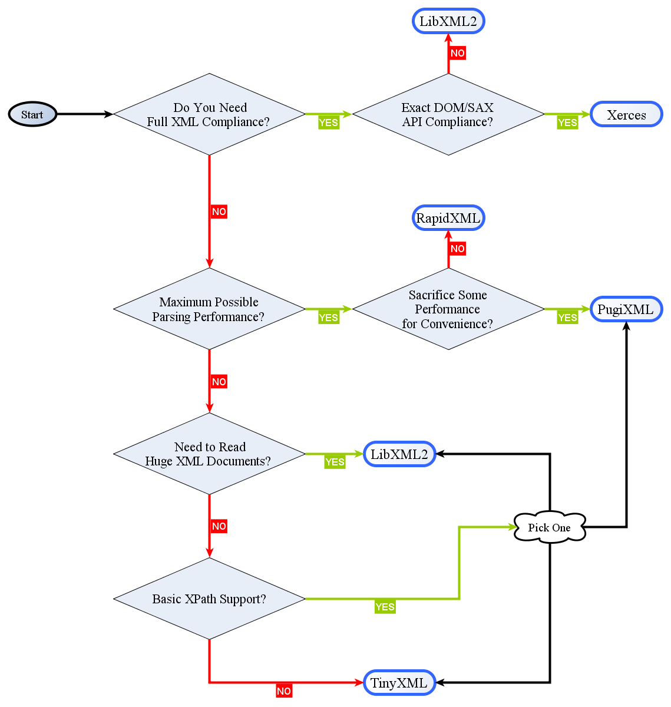

# C++笔记
## mingw
### install

1. [点击下载](https://sourceforge.net/projects/mingw-w64/files/Toolchains%20targetting%20Win32/Personal%20Builds/mingw-builds/7.2.0/threads-posix/dwarf/i686-7.2.0-release-posix-dwarf-rt_v5-rev1.7z/download)至`E:\CPP\down\i686-7.2.0-release-posix-dwarf-rt_v5-rev1.7z`

1. 解压` i686-7.2.0-release-posix-dwarf-rt_v5-rev1.7z`至`E:\CPP\green\mingw32-posix\`

1. `copy E:\CPP\green\mingw32-posix\bin\i686-w64-mingw32-gcc.exe E:\CPP\green\mingw32-posix\bin\mingw32-gcc.exe`

1. `PATH`中增加`E:\CPP\green\mingw32-posix\bin\; E:\CPP\green\mingw32-posix\opt\bin\;`

1. 编写测试程序
   > test.cpp
   
   ```c
   #include <ctime>
   #include <cstdlib>
   #include <iostream>
   
   int main() {
       /* use current time as seed for random generator */
       std::time_t now = std::time(NULL);
       std::cout << "now: " << now << "\n";
       std::srand(now);
       /* random sequence in [0, 1) */
       for (int i = 0; i < 10; i++)
           std::cout << std::rand() / (RAND_MAX + 1.0) << "\n";
       getchar();
       return 0;
   }
   ```

1. 编译、链接
   ```bash
   g++ -std=c++11 -O3 -Wall -fmessage-length=0 -o test.exe test.cpp
   ```

- x86_64 vs i686
   > - `x86_64`: Toolchains targetting Win64
   > - `i686`: Toolchains targetting Win32

- posix vs win32
   > https://stackoverflow.com/questions/13212342/whats-the-difference-between-thread-posixs-and-thread-win32-in-gcc-port-of-windo
   >
   > In short, for this version of mingw, the threads-posix release will use the posix API and **allow the use of std::thread**, and the threads-win32 will use the win32 API, and **disable the std::thread part of the standard**.

   > https://stackoverflow.com/questions/17242516/mingw-w64-threads-posix-vs-win32
   > - `posix`: enable C++11/C11 multithreading features. Makes libgcc depend on libwinpthreads, so that even if you don't directly call pthreads API, you'll be distributing the winpthreads DLL. There's nothing wrong with distributing one more DLL with your application.
   > - `win32`: No C++11 multithreading features.

- sjlj vs dwarf vs seh
   > - `sjlj`: setjmp/longjmp, available for 32 bit and 64 bit
   > - `dwarf`: DW2, dwarf-2, available for 32 bit only
   > - `seh`: zero overhead exception, available for 64 bit only

## libcurl
### install with ssl

1. [点击下载](https://curl.haxx.se/download/curl-7.61.1.zip)至`E:\CPP\down\curl-7.61.1.zip`，并解压至`E:\CPP\library\curl-7.61.1\`

1. [点击下载](https://bintray.com/vszakats/generic/download_file?file_path=openssl-1.1.1-win32-mingw.zip)至`E:\CPP\down\openssl-1.1.1_6-win32-mingw.zip`，并解压至`E:\CPP\library\openssl-1.1.1\`，参考`https://github.com/curl/curl-for-win`和`https://curl.haxx.se/windows/`

1. 设置环境变量，`set OPENSSL_PATH=E:/CPP/library/openssl-1.1.1`

1. 运行`E:\CPP\library\curl-7.61.1>mingw32-make mingw32-ssl >> make.txt`，将会在`lib`和`src`目录下分别产生库文件和可执行文件

1. 编写测试程序 

   > curl_test.cpp

   ```c
   #include <iostream>
   #include <fstream>
   #include <sstream>
   #include <curl/curl.h>
   
   static size_t write_callback(char *ptr, size_t size, size_t nmemb, void *userdata) {
       ((std::ostringstream *) userdata)->write((char*) ptr, size * nmemb);
       return size * nmemb;
   }
   
   int main(void) {
       /* Start a libcurl easy session */
       CURL* curl = curl_easy_init();
       if (curl) {
           /* provide the URL to use in the request */
           curl_easy_setopt(curl, CURLOPT_URL, "http://www.xd.com/");
           /* specify data to POST to server */
           // curl_easy_setopt(curl, CURLOPT_POSTFIELDS, "name=daniel&project=curl");
           /* verify the peer's SSL certificate */
           curl_easy_setopt(curl, CURLOPT_SSL_VERIFYPEER, 0L);
           /* follow HTTP 3xx redirects */
           curl_easy_setopt(curl, CURLOPT_FOLLOWLOCATION, 1L);
           /* set verbose mode on/off */
           curl_easy_setopt(curl, CURLOPT_VERBOSE, 1L);
           /* set callback for writing received data */
           curl_easy_setopt(curl, CURLOPT_WRITEFUNCTION, write_callback);
           /* pointer to pass to header callback */
           std::ostringstream oss_head;
           curl_easy_setopt(curl, CURLOPT_HEADERDATA, &oss_head);
           /* custom pointer passed to the write callback */
           std::ostringstream oss_body;
           curl_easy_setopt(curl, CURLOPT_WRITEDATA, &oss_body);
           /* perform a blocking file transfer */
           CURLcode res = curl_easy_perform(curl);
           if (res != CURLE_OK)
               std::cerr << curl_easy_strerror(res) << "\n";
           /* save response head and body to file */
           std::ofstream file("xd.html", std::ios::binary | std::ios::out);
           file << oss_head.str() << oss_body.str();
           file.close();
           /* End a libcurl easy handle */
           curl_easy_cleanup(curl);
       }
       getchar();
       return 0;
   }
   ```

1. 编译、链接
   ```bash
   /* 静态链接 */
   g++ -std=c++11 -DCURL_STATICLIB -IE:\\CPP\\library\\curl-7.61.1\\include -O3 -Wall -c -fmessage-length=0 -o curl_test_static.o curl_test.cpp
   g++ -static -o curl_test_static.exe curl_test_static.o -LE:\\CPP\\library\\curl-7.61.1\\lib -lcurl -LE:/CPP/library/openssl-1.1.1/lib -lssl -lcrypto -lwldap32 -lws2_32
   pause
   ```
   ```bash
   /* 动态链接(运行时需libcurl.dll、libcrypto-1_1.dll、libssl-1_1.dll，推荐) */
   g++ -std=c++11 -IE:\\CPP\\library\\curl-7.61.1\\include -O3 -Wall -c -fmessage-length=0 -o curl_test.o curl_test.cpp
   g++ -LE:\\CPP\\library\\curl-7.61.1\\lib -o curl_test.exe curl_test.o -lcurldll
   pause
   ```

- `-O3`: Optimize most.
- `-Wall`: All warnings.
- `-c`: Compile and assemble, but do not link.
- `-fmessage-length=n`: Try to format error messages so that they fit on lines of about n characters. The default is **72** characters for g++ and 0 for the rest of the front ends supported by GCC. **If n is zero, then no line-wrapping is done; each error message appears on a single line.**
- `-static`: On systems that support dynamic linking, this prevents linking with the shared libraries. On other systems, this option has no effect. 

## socket

### hello world

1. 编写测试程序

   > socket_test.cpp

   ```c++
   #include <winsock2.h>
   #include <fstream>
   
   #define RCVBUFSIZE 16
   
   int main(void) {
       WSADATA wsadata;
       WSAStartup(WINSOCK_VERSION, &wsadata);
   
       const char* host = "sxd.xd.com";
   
       struct hostent *hostent;
       if ((hostent = gethostbyname(host)) == NULL)
           return 1;
   
       unsigned short port = 80;
       struct sockaddr_in addr;
       memset(&addr, 0, sizeof(sockaddr));
       addr.sin_family = AF_INET;
       addr.sin_addr.s_addr = *((unsigned long*) hostent->h_addr_list[0]);
       addr.sin_port = htons(port);
   
       int sock = socket(PF_INET, SOCK_STREAM, IPPROTO_TCP);
   
       if (connect(sock, (struct sockaddr *) &addr, sizeof(addr)) < 0)
           return 2;
   
       const char* msg = "GET / HTTP/1.1\r\nHost: sxd.xd.com\r\nConnection: close\r\n\r\n";
       if (send(sock, msg, strlen(msg), 0) != (int) strlen(msg))
           return 3;
   
       std::ofstream file("sxd.html", std::ios::binary | std::ios::out);
       char buffer[RCVBUFSIZE];
       int bytesRcvd;
       for (;;) {
           bytesRcvd = recv(sock, buffer, RCVBUFSIZE - 1, 0);
           if (bytesRcvd == 0)
               break;
           if (bytesRcvd < 0)
               return 4;
           buffer[bytesRcvd] = '\0';
           file << buffer;
       }
       file.close();
       
       closesocket(sock);
   
       WSACleanup();
       getchar();
       return 0;
   }
   ```

1. 编译、链接
   ```bash
   g++ -std=c++11 -O3 -Wall -c -fmessage-length=0 -o socket_test.o socket_test.cpp 
   g++ -o socket_test.exe socket_test.o -lws2_32 
   pause
   ```

1. 运行

   > sxd.html

   ```http
   HTTP/1.1 200 OK
   Date: Wed, 03 Oct 2018 13:00:07 GMT
   Content-Type: text/html; charset=UTF-8
   Transfer-Encoding: chunked
   Connection: close
   Set-Cookie: aliyungf_tc=AQAAAGXIp2QfkQEAV8R5tDH2FzNAfsW9; Path=/; HttpOnly
   Cache-Control: max-age=3, must-revalidate
   WP-Super-Cache: Served supercache file from PHP
   
   323d
   <!DOCTYPE html>
   <html dir="ltr" lang="zh-CN">
   ...
   ```

## string
### encoding convert
1. 编写测试程序

   > conv_between.cpp

   ```c++
   #include <cstring>  // strlen()
   #include <sstream>
   #include <iostream>
   #include <iconv.h>
   
   #define BUFFER_SIZE 1024
   
   ///
   /// Convert a \a text to \a to_encoding from \a from_encoding
   ///
   std::string conv_between(const char* text, const std::string &to_encoding, const std::string &from_encoding) {
       /* iconv_open */
       iconv_t cd = iconv_open(to_encoding.c_str(), from_encoding.c_str());
       if (cd == (iconv_t) -1) {
           perror("iconv_open");
           throw std::runtime_error("iconv_open");
       }
       /* buffer */
       char buffer[BUFFER_SIZE];
       /* four parameters for iconv */
       char* inbuf = (char*) text;
       size_t inbytesleft = strlen(text);
       char *outbuf;
       size_t outbytesleft;
   
       /* If all input from the input buffer is successfully converted and stored in the output buffer, the
        * function returns the number of non-reversible conversions performed. In all other cases the
        * return value is (size_t) -1 and errno is set appropriately. In such cases the value pointed to by
        * inbytesleft is nonzero.
        * - E2BIG The conversion stopped because it ran out of space in the output buffer. */
       std::ostringstream oss;
       while (inbytesleft) {
           outbuf = buffer;
           outbytesleft = BUFFER_SIZE;
           if (iconv(cd, &inbuf, &inbytesleft, &outbuf, &outbytesleft) == (size_t) -1 && errno != E2BIG) {
               iconv_close(cd);
               perror("iconv");
               throw std::runtime_error("iconv");
           }
           oss.write(buffer, BUFFER_SIZE - outbytesleft);
       }
       /* iconv_close */
       iconv_close(cd);
       return oss.str();
   }
   
   int main() {
       std::cout << conv_between("GBK \xB5\xE7\xCA\xD3\xBB\xFA", "utf-8", "gbk") << "\n";
       std::cout << conv_between("UTF-8 \xE7\x94\xB5\xE8\xA7\x86\xE6\x9C\xBA", "GBK", "UTF-8") << "\n";
       getchar();
       return 0;
   }
   ```

1. 编译、链接
   ```bash
   g++ -std=c++11 -O3 -Wall -c -fmessage-length=0 -o conv_between.o conv_between.cpp 
   g++ -o conv_between.exe conv_between.o -liconv
   pause
   ```

### json
1. 到页面`https://github.com/nlohmann/json/releases`下载`json.hpp`

1. 编写测试程序

   > json_test.cpp

   ```c++
   #include <iostream>
   #include <string>
   #include <nlohmann/json.hpp>
   
   int main() {
       // create object from string literal
       nlohmann::json j = "{ \"happy\": true, \"pi\": 3.141 }"_json;
   
       // or even nicer with a raw string literal
       auto j2 = R"(
         {
           "happy": true,
           "pi": 3.141
         }
       )"_json;
   
       // parse explicitly
       auto j3 = nlohmann::json::parse("{ \"happy\": true, \"pi\": 3.141 }");
   
       // explicit conversion to string
       std::string s = j.dump();    // {\"happy\":true,\"pi\":3.141}
   
       // serialization with pretty printing
       // pass in the amount of spaces to indent
       std::cout << j.dump(4) << std::endl;
       // {
       //     "happy": true,
       //     "pi": 3.141
       // }
   
       // store a string in a JSON value
       nlohmann::json j_string = "this is a string";
   
       // retrieve the string value (implicit JSON to std::string conversion)
       std::string cpp_string = j_string;
       // retrieve the string value (explicit JSON to std::string conversion)
       auto cpp_string2 = j_string.get<std::string>();
       // retrieve the string value (alternative explicit JSON to std::string conversion)
       std::string cpp_string3;
       j_string.get_to(cpp_string3);
       // get_ptr
       auto cpp_string4 = j_string.get_ptr<std::string *>();
       auto cpp_string5 = j_string.get_ptr<nlohmann::json::string_t *>();
       // get_ref
       auto cpp_string6 = j_string.get_ref<std::string &>();
       auto cpp_string7 = j_string.get_ref<nlohmann::json::string_t &>();
   
       // retrieve the serialized value (explicit JSON serialization)
       std::string serialized_string = j_string.dump();
   
       // output of original string
       std::cout << cpp_string << " == " << cpp_string2 << " == " << cpp_string3 << " == " << *cpp_string4 << " == " << *cpp_string5 << " == " << cpp_string6 << " == " << cpp_string7 << '\n';
       // output of serialized value
       std::cout << j_string << " == " << serialized_string << std::endl;
   
       getchar();
       return 0;
   }
   ```

1. 编译、链接
   ```bash
   g++ -std=c++11 -IE:\\CPP\\library\\json-3.3.0\\include -O3 -Wall -c -fmessage-length=0 -o json_test.o json_test.cpp 
   g++ -o json_test.exe json_test.o
   pause
   ```
   
### xml



### base64

1. 到页面`https://github.com/ReneNyffenegger/cpp-base64`下载`base64.cpp`和`base64.h`
1. 编写测试程序
   > base64_test.cpp
   
   ```c++
   #include "base64.h"
   #include <iostream>
   
   int main() {
     const std::string s = 
       "René Nyffenegger\n"
       "http://www.renenyffenegger.ch\n"
       "passion for data\n";
   
     std::string encoded = base64_encode(reinterpret_cast<const unsigned char*>(s.c_str()), s.length());
     std::string decoded = base64_decode(encoded);
   
     std::cout << "encoded: " << std::endl << encoded << std::endl << std::endl;
     std::cout << "decoded: " << std::endl << decoded << std::endl;
   
   
     // Test all possibilites of fill bytes (none, one =, two ==)
     // References calculated with: https://www.base64encode.org/
   
     std::string rest0_original = "abc";
     std::string rest0_reference = "YWJj";
   
     std::string rest0_encoded = base64_encode(reinterpret_cast<const unsigned char*>(rest0_original.c_str()),
       rest0_original.length());
     std::string rest0_decoded = base64_decode(rest0_encoded);
   
     std::cout << "encoded:   " << rest0_encoded << std::endl;
     std::cout << "reference: " << rest0_reference << std::endl;
     std::cout << "decoded:   " << rest0_decoded << std::endl << std::endl;
   
   
     std::string rest1_original = "abcd";
     std::string rest1_reference = "YWJjZA==";
   
     std::string rest1_encoded = base64_encode(reinterpret_cast<const unsigned char*>(rest1_original.c_str()),
       rest1_original.length());
     std::string rest1_decoded = base64_decode(rest1_encoded);
   
     std::cout << "encoded:   " << rest1_encoded << std::endl;
     std::cout << "reference: " << rest1_reference << std::endl;
     std::cout << "decoded:   " << rest1_decoded << std::endl << std::endl;
   
   
     std::string rest2_original = "abcde";
     std::string rest2_reference = "YWJjZGU=";
   
     std::string rest2_encoded = base64_encode(reinterpret_cast<const unsigned char*>(rest2_original.c_str()),
       rest2_original.length());
     std::string rest2_decoded = base64_decode(rest2_encoded);
   
     std::cout << "encoded:   " << rest2_encoded << std::endl;
     std::cout << "reference: " << rest2_reference << std::endl;
     std::cout << "decoded:   " << rest2_decoded << std::endl << std::endl;
   
     return 0;
   }
   ```
1. 编译、链接
   ```bash
   g++ -std=c++11 -O3 -Wall -c -fmessage-length=0 -o base64_test.o base64_test.cpp 
   g++ -std=c++11 -O3 -Wall -c -fmessage-length=0 -o base64.o base64.cpp 
   g++ -o base64_test.exe base64_test.o base64.o
   pause
   ```

### format

1. 编写测试程序
   > format_test.cpp
   
   ```c++
   #include <vector>
   #include <cstdio>
   #include <cstdarg>
   #include <ctime>
   
   void debug_log(const char *fmt, ...) {
       std::time_t t = std::time(nullptr);
       char time_buf[100];
       std::strftime(time_buf, sizeof time_buf, "%Y-%m-%d %H:%M:%S", std::gmtime(&t));
       va_list args1;
       va_start(args1, fmt);
       va_list args2;
       va_copy(args2, args1);
       std::vector<char> buf(1 + std::vsnprintf(nullptr, 0, fmt, args1));
       va_end(args1);
       std::vsnprintf(buf.data(), buf.size(), fmt, args2);
       va_end(args2);
       std::printf("%s [debug]: %s\n", time_buf, buf.data());
   }
   
   int main() {
       debug_log("Logging, %d, %d, %d", 1, 2, 3);
   }
   ```
   
1. 编译、链接
   
   ```bash
   g++ -std=c++11 -O3 -Wall -c -fmessage-length=0 -o format_test.o format_test.cpp 
   g++ -o format_test.exe format_test.o
   pause
   ```

## shell

1. 编写测试程序
   
   > shell_test.cpp
   
   ```c++
   #include <cstring>  // strchr()
   #include <iostream> // std::cout, std::cerr
   #include <memory>   // std::shared_ptr
   #include <sstream>  // std::ostringstream
   
   void exec(const char* command) {
   	const int BUFFER_SIZE = 8;
   	char buffer[BUFFER_SIZE];
   	std::ostringstream oss;
   	std::shared_ptr<FILE> pipe(popen(command, "r"), pclose);
   	if (!pipe)
   		throw std::runtime_error("popen() failed!");
   	while (fgets(buffer, BUFFER_SIZE, pipe.get())) {
   		oss << buffer;
   		int len = strlen(buffer);
   		if (!len)
   			throw std::runtime_error("strlen(buffer) == 0");
   		if (buffer[len - 1] == '\n' || feof(pipe.get())) {
   			std::cout << oss.str() << std::flush;
   			oss.str("");
   			continue;
   		}
   		if (len != BUFFER_SIZE - 1)
   			throw std::runtime_error("strlen(buffer) != BUFFER_SIZE - 1");
   	}
   	if (ferror(pipe.get()))
   		throw std::runtime_error("fgets() failed!");
   } //exec
   
   int main() {
   	try {
   		exec("dir");
   	} catch (const std::exception& ex) {
   		std::cerr << ex.what() << "\n";
   		return 1;
   	}
   	return 0;
   } //main
   ```

1. 编译、链接
   
   ```bash
   g++ -std=c++11 -O3 -Wall -c -fmessage-length=0 -o shell_test.o shell_test.cpp 
   g++ -o shell_test.exe shell_test.o
   pause
   ```


