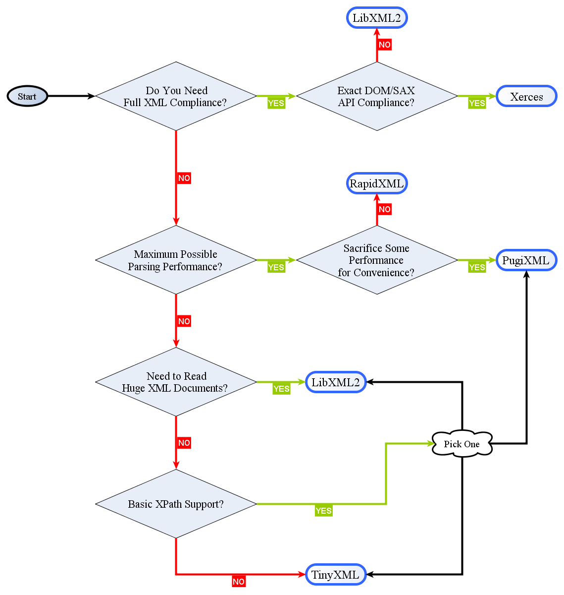

## string
### encoding convert
1. 编写测试程序

   > conv_between.cpp

   ```c++
   #include <cstring>  // strlen()
   #include <sstream>
   #include <iostream>
   #include <iconv.h>
   
   #define BUFFER_SIZE 1024
   
   ///
   /// Convert a \a text to \a to_encoding from \a from_encoding
   ///
   std::string conv_between(const char* text, const std::string &to_encoding, const std::string &from_encoding) {
       /* iconv_open */
       iconv_t cd = iconv_open(to_encoding.c_str(), from_encoding.c_str());
       if (cd == (iconv_t) -1) {
           perror("iconv_open");
           throw std::runtime_error("iconv_open");
       }
       /* buffer */
       char buffer[BUFFER_SIZE];
       /* four parameters for iconv */
       char* inbuf = (char*) text;
       size_t inbytesleft = strlen(text);
       char *outbuf;
       size_t outbytesleft;
   
       /* If all input from the input buffer is successfully converted and stored in the output buffer, the
        * function returns the number of non-reversible conversions performed. In all other cases the
        * return value is (size_t) -1 and errno is set appropriately. In such cases the value pointed to by
        * inbytesleft is nonzero.
        * - E2BIG The conversion stopped because it ran out of space in the output buffer. */
       std::ostringstream oss;
       while (inbytesleft) {
           outbuf = buffer;
           outbytesleft = BUFFER_SIZE;
           if (iconv(cd, &inbuf, &inbytesleft, &outbuf, &outbytesleft) == (size_t) -1 && errno != E2BIG) {
               iconv_close(cd);
               perror("iconv");
               throw std::runtime_error("iconv");
           }
           oss.write(buffer, BUFFER_SIZE - outbytesleft);
       }
       /* iconv_close */
       iconv_close(cd);
       return oss.str();
   }
   
   int main() {
       std::cout << conv_between("GBK \xB5\xE7\xCA\xD3\xBB\xFA", "utf-8", "gbk") << "\n";
       std::cout << conv_between("UTF-8 \xE7\x94\xB5\xE8\xA7\x86\xE6\x9C\xBA", "GBK", "UTF-8") << "\n";
       getchar();
       return 0;
   }
   ```

1. 编译、链接
   ```bash
   g++ -std=c++11 -O3 -Wall -c -fmessage-length=0 -o conv_between.o conv_between.cpp 
   g++ -o conv_between.exe conv_between.o -liconv
   pause
   ```

### json
1. 到页面`https://github.com/nlohmann/json/releases`下载`json.hpp`

1. 编写测试程序

   > json_test.cpp

   ```c++
   #include <iostream>
   #include <string>
   #include <nlohmann/json.hpp>
   
   int main() {
       // create object from string literal
       nlohmann::json j = "{ \"happy\": true, \"pi\": 3.141 }"_json;
   
       // or even nicer with a raw string literal
       auto j2 = R"(
         {
           "happy": true,
           "pi": 3.141
         }
       )"_json;
   
       // parse explicitly
       auto j3 = nlohmann::json::parse("{ \"happy\": true, \"pi\": 3.141 }");
   
       // explicit conversion to string
       std::string s = j.dump();    // {\"happy\":true,\"pi\":3.141}
   
       // serialization with pretty printing
       // pass in the amount of spaces to indent
       std::cout << j.dump(4) << std::endl;
       // {
       //     "happy": true,
       //     "pi": 3.141
       // }
   
       // store a string in a JSON value
       nlohmann::json j_string = "this is a string";
   
       // retrieve the string value (implicit JSON to std::string conversion)
       std::string cpp_string = j_string;
       // retrieve the string value (explicit JSON to std::string conversion)
       auto cpp_string2 = j_string.get<std::string>();
       // retrieve the string value (alternative explicit JSON to std::string conversion)
       std::string cpp_string3;
       j_string.get_to(cpp_string3);
       // get_ptr
       auto cpp_string4 = j_string.get_ptr<std::string *>();
       auto cpp_string5 = j_string.get_ptr<nlohmann::json::string_t *>();
       // get_ref
       auto cpp_string6 = j_string.get_ref<std::string &>();
       auto cpp_string7 = j_string.get_ref<nlohmann::json::string_t &>();
   
       // retrieve the serialized value (explicit JSON serialization)
       std::string serialized_string = j_string.dump();
   
       // output of original string
       std::cout << cpp_string << " == " << cpp_string2 << " == " << cpp_string3 << " == " << *cpp_string4 << " == " << *cpp_string5 << " == " << cpp_string6 << " == " << cpp_string7 << '\n';
       // output of serialized value
       std::cout << j_string << " == " << serialized_string << std::endl;
   
       getchar();
       return 0;
   }
   ```

1. 编译、链接
   ```bash
   g++ -std=c++11 -IE:\\CPP\\library\\json-3.3.0\\include -O3 -Wall -c -fmessage-length=0 -o json_test.o json_test.cpp 
   g++ -o json_test.exe json_test.o
   pause
   ```
   
### xml



### base64

1. 到页面`https://github.com/ReneNyffenegger/cpp-base64`下载`base64.cpp`和`base64.h`
1. 编写测试程序
   > base64_test.cpp
   
   ```c++
   #include "base64.h"
   #include <iostream>
   
   int main() {
     const std::string s = 
       "René Nyffenegger\n"
       "http://www.renenyffenegger.ch\n"
       "passion for data\n";
   
     std::string encoded = base64_encode(reinterpret_cast<const unsigned char*>(s.c_str()), s.length());
     std::string decoded = base64_decode(encoded);
   
     std::cout << "encoded: " << std::endl << encoded << std::endl << std::endl;
     std::cout << "decoded: " << std::endl << decoded << std::endl;
   
   
     // Test all possibilites of fill bytes (none, one =, two ==)
     // References calculated with: https://www.base64encode.org/
   
     std::string rest0_original = "abc";
     std::string rest0_reference = "YWJj";
   
     std::string rest0_encoded = base64_encode(reinterpret_cast<const unsigned char*>(rest0_original.c_str()),
       rest0_original.length());
     std::string rest0_decoded = base64_decode(rest0_encoded);
   
     std::cout << "encoded:   " << rest0_encoded << std::endl;
     std::cout << "reference: " << rest0_reference << std::endl;
     std::cout << "decoded:   " << rest0_decoded << std::endl << std::endl;
   
   
     std::string rest1_original = "abcd";
     std::string rest1_reference = "YWJjZA==";
   
     std::string rest1_encoded = base64_encode(reinterpret_cast<const unsigned char*>(rest1_original.c_str()),
       rest1_original.length());
     std::string rest1_decoded = base64_decode(rest1_encoded);
   
     std::cout << "encoded:   " << rest1_encoded << std::endl;
     std::cout << "reference: " << rest1_reference << std::endl;
     std::cout << "decoded:   " << rest1_decoded << std::endl << std::endl;
   
   
     std::string rest2_original = "abcde";
     std::string rest2_reference = "YWJjZGU=";
   
     std::string rest2_encoded = base64_encode(reinterpret_cast<const unsigned char*>(rest2_original.c_str()),
       rest2_original.length());
     std::string rest2_decoded = base64_decode(rest2_encoded);
   
     std::cout << "encoded:   " << rest2_encoded << std::endl;
     std::cout << "reference: " << rest2_reference << std::endl;
     std::cout << "decoded:   " << rest2_decoded << std::endl << std::endl;
   
     return 0;
   }
   ```
1. 编译、链接
   ```bash
   g++ -std=c++11 -O3 -Wall -c -fmessage-length=0 -o base64_test.o base64_test.cpp 
   g++ -std=c++11 -O3 -Wall -c -fmessage-length=0 -o base64.o base64.cpp 
   g++ -o base64_test.exe base64_test.o base64.o
   pause
   ```

### format

1. 编写测试程序
   > format_test.cpp
   
   ```c++
   #include <vector>
   #include <cstdio>
   #include <cstdarg>
   #include <ctime>
   
   void debug_log(const char *fmt, ...) {
       std::time_t t = std::time(nullptr);
       char time_buf[100];
       std::strftime(time_buf, sizeof time_buf, "%Y-%m-%d %H:%M:%S", std::gmtime(&t));
       va_list args1;
       va_start(args1, fmt);
       va_list args2;
       va_copy(args2, args1);
       std::vector<char> buf(1 + std::vsnprintf(nullptr, 0, fmt, args1));
       va_end(args1);
       std::vsnprintf(buf.data(), buf.size(), fmt, args2);
       va_end(args2);
       std::printf("%s [debug]: %s\n", time_buf, buf.data());
   }
   
   int main() {
       debug_log("Logging, %d, %d, %d", 1, 2, 3);
   }
   ```
   
1. 编译、链接
   
   ```bash
   g++ -std=c++11 -O3 -Wall -c -fmessage-length=0 -o format_test.o format_test.cpp 
   g++ -o format_test.exe format_test.o
   pause
   ```
