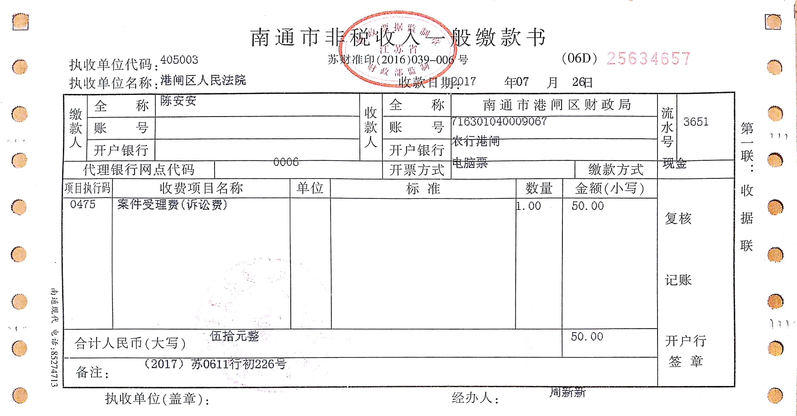

## 孕妇维权
### 行政诉讼
- 立案  

- 起诉状  
打印一式三份，自己留一份，其余两份交法院立案时用
- 证据材料  
答复书复印两份，起诉时只要提交复印件
- 身份证复印件  
正反复印一份
- 送达地址确认书  
打印一份签字
- 授权委托书  
打印一份签字  
李子的身份证复印件(也是正反面)  
如户口在一起，则复印户口本证明家庭关系；如户口不在一起，则复印结婚证  
- [录音](录音)
### 举报
举报事项：
1、《劳动合同法》第十九条第四款  试用期包含在劳动合同期限内。劳动合同仅约定试用期的，试用期不成立，该期限为劳动合同期限。
濠云公司违反法律规定，仅与蔡书铭、朱蓓蓓签订《员工试用合同》，且涉嫌试用期内不缴纳社会保险。
2、《社会保险法》第十二条第一款　用人单位应当按照国家规定的本单位职工工资总额的比例缴纳基本养老保险费，记入基本养老保险统筹基金。
第八十六条　用人单位未按时足额缴纳社会保险费的，由社会保险费征收机构责令限期缴纳或者补足，并自欠缴之日起，按日加收万分之五的滞纳金；逾期仍不缴纳的，由有关行政部门处欠缴数额一倍以上三倍以下的罚款。
从劳动监察证据材料看，濠云公司涉嫌普遍存在缴费基数不足、未按时足额缴纳社会保险费的问题。（包括但不限于举报人陈安安）
3、《中华人民共和国就业促进法》 第六十七条 违反本法规定，企业未按照国家规定提取职工教育经费，或者挪用职工教育经费的，由劳动行政部门责令改正，并依法给予处罚。
举报人工作期间，企业未组织教育和培训，故怀疑濠云公司涉嫌未按照国家规定提取职工教育经费，或者挪用职工教育经费。
