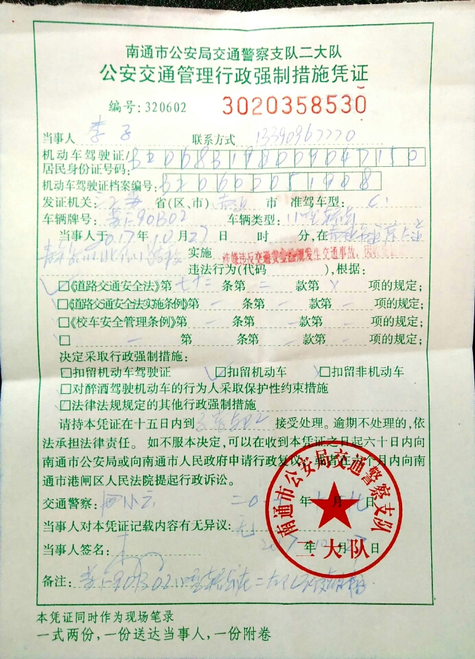
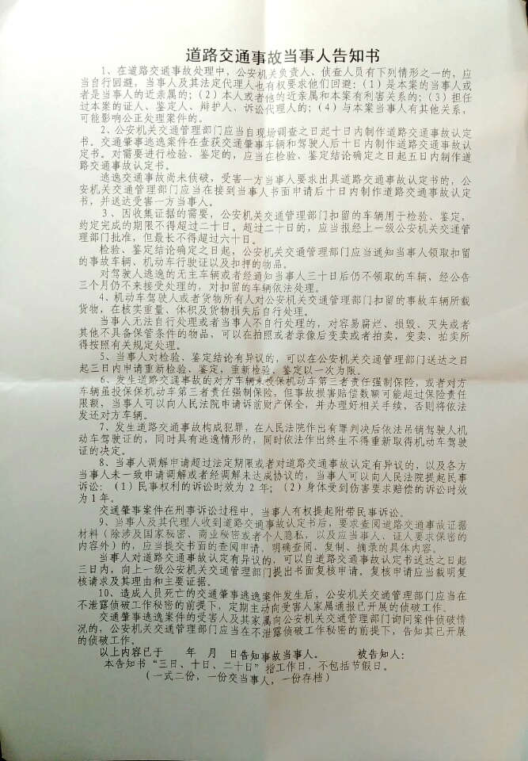

## 驾驶逃逸

- 2017-10-27 09:14
苏F90B02由北向南直行通过通京大道青年路路口红绿灯时，苏FB0N77白色轿车从左侧抢道碰撞我车的左侧后视镜，随后向左转弯驶入青年路向东。已报警！
- 2017-10-27 09:31
交警二大队051383507548打来电话，了解情况，并核实该轿车为起亚白色轿车。随后准备联系车主，约时间去二大队处理。我说等你电话。
- 2017-10-27 11:18
二大队确认对方驾驶员知道刮到反光镜，以为没事就走了，并非不知情。
- 2017-10-27 15:03
苏FB0N77车主(于彬，19781222)在交警二大队接受处理，于彬没有开苏FB0N77的车过来，我就很不高兴，凭什么我开苏F90B02的车来了，而于彬没有开车苏FB0N77来？等到交警强制让他开车来，已经是快18点了。交警试图调解，于彬态度恶劣，没有调解成功。
- 2017-10-27 18:00
田小云警官给双方开具“公安交通管理行政强制措施凭证”，和“道路交通事故当事人告知书”，并扣留双方机动车，等待调查结果。

